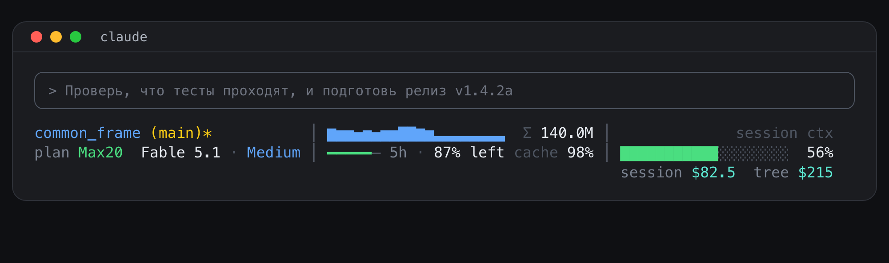
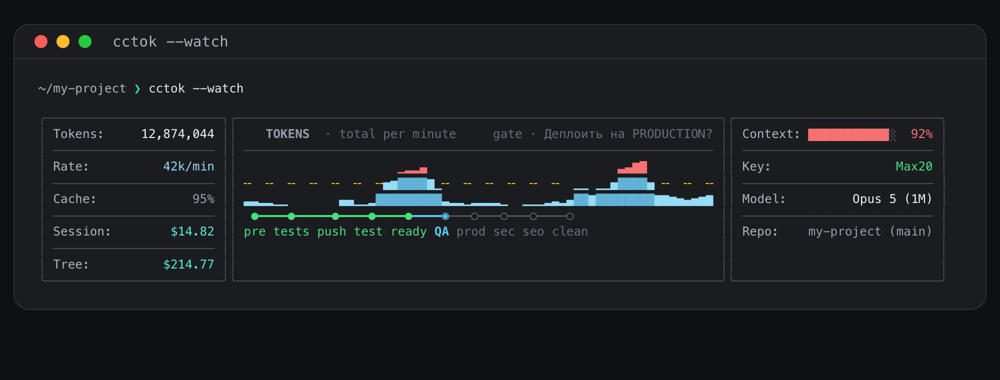
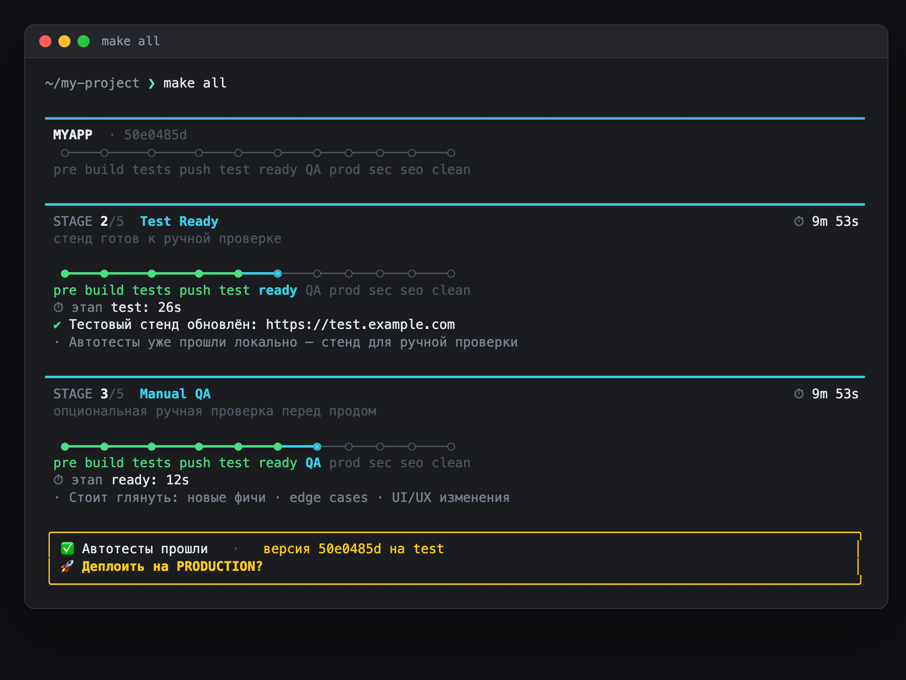

<h1 align="center">Common</h1>

<p align="center">
  <b>Фреймворк автономной разработки Commoncode</b> для Claude Code, Codex и других CLI —<br>
  плюс терминальные панели, которые показывают, чем занята сессия и сколько она стоит.
</p>

<p align="center">
  <i>Autonomous multi-phase dev framework (Architect → Code → QA → Debug) + terminal panels for AI coding CLIs.</i>
</p>

<p align="center">
  
  
  
  
</p>

<p align="center">
  
</p>

```bash
curl -fsSL https://raw.githubusercontent.com/commonkid/common-framework/main/setup.sh | bash
```

---

Два продукта в одном репозитории, ставятся одним установщиком:

| продукт | что это | куда ставится |
|---|---|---|
| **Common Framework** | фреймворк **Commoncode**: скиллы, агенты, команды и правила для автономной многофазной разработки (Architect → Code → QA → Debug) | Claude Code, Codex, Kilo Code, OpenCode, Cursor, Antigravity или любая другая CLI, читающая папки `SKILL.md` |
| **Common Usage** | терминальные панели: статуслайн Claude Code, статус-строка Codex, панель сессии `cctok`, рельс деплоя `pipeline` | `~/.claude`, `~/.codex` (читают транскрипты сессий) |

Фреймворк **двусторонний**: один и тот же Commoncode портирован под обе модели, `claude/` и
`codex/` — зеркала друг друга. Common Usage работает поверх Claude Code и показывает, в какой
фазе фреймворка находится сессия.

Нужны только `git` и `python3` (3.8+) — сторонних зависимостей нет.

---

## Установка

Одной строкой (см. выше) — либо из клона:

```bash
git clone https://github.com/commonkid/common-framework.git
cd common-framework
./setup.sh
```

Установщик работает в терминале и спрашивает по шагам (стрелки — двигаться, пробел — отметить,
Enter — дальше):

1. **Для каких CLI** ставим Common Framework — Claude Code, Codex, Kilo Code, OpenCode, Cursor,
   Antigravity, другая CLI (укажешь папку). Найденные на машине отмечены заранее; можно выбрать
   несколько, каждая настраивается по своей раскладке.
2. **Что ставим** — Common Framework, Common Usage или оба. Common Usage читает транскрипты
   Claude Code, поэтому предлагается, когда выбран Claude Code.
3. **Блоки Common Framework** — ядро ставится всегда, остальное по желанию:
   `develop`, `dev-base`, `master-prompt`, `ultraprompt`, `version-test`.
4. **Блоки Common Usage** — `statusline`, `cctok`, `codex-statusline`, `pipeline`.
5. Показывает план и ждёт подтверждения.

Куда ложится фреймворк в каждой CLI:

| CLI | папка | правила | `/develop` | скиллы |
|---|---|---|---|---|
| Claude Code | `~/.claude` | `rules/*.md` | `commands/develop.md` + агенты `mode-code`, `mode-qa` | `skills/commoncode/` (плагин) и остальные |
| Codex | `~/.codex` | `AGENTS.md` | `prompts/develop.md` | `skills/commoncode-*` |
| Kilo Code | `~/.kilo` (или `~/.kilocode`) | `rules/commoncode.md` | `workflows/develop.md` | `skills/` |
| OpenCode | `~/.config/opencode` | `AGENTS.md` | `commands/develop.md` | `skills/` |
| Cursor | `~/.cursor` | нет глобальных — положи `codex/AGENTS.md` как `AGENTS.md` в корень проекта | скилл `develop` | `skills/` |
| Antigravity | `~/.gemini` | `GEMINI.md` | скилл `develop` | `config/skills/` |

Папки переопределяются переменными `CLAUDE_CONFIG_DIR`, `CODEX_HOME`, `COMMON_KILO_DIR`,
`COMMON_OPENCODE_DIR`, `COMMON_CURSOR_DIR`, `COMMON_ANTIGRAVITY_DIR`. В Kilo, OpenCode, Cursor и
Antigravity ставится плоская раскладка скиллов (та же, что у Codex): `mode-code` и `mode-qa` там —
скиллы, флоу идёт в одном контексте.

Всё, что будет перезаписано, сначала копируется в `<цель>/.common-setup-backup-<дата>/`.
`settings.json` при подключении статуслайна получает копию `settings.json.bak`.

Без вопросов и для скриптов:

```bash
./setup.sh --all --yes                                        # всё, во все найденные CLI
./setup.sh --products framework --cli claude,codex,kilo,opencode,cursor,antigravity --blocks all --yes
./setup.sh --products framework --cli claude,codex --blocks core,develop --yes
./setup.sh --products usage --usage-blocks statusline,cctok --yes
./setup.sh --dry-run                                          # только показать план
./setup.sh --list                                             # каталог блоков
```

Ещё переменные: `COMMON_BIN_DIR` (куда класть команды `cctok` / `pipeline`, по умолчанию
`~/.local/bin`), `COMMON_FRAMEWORK_HOME` (куда curl-вариант клонирует репозиторий, по умолчанию
`~/.common-framework`).

`restore.sh` оставлен для совместимости и равен `setup.py --all --yes`.

После установки перезапусти CLI. В Claude Code должны появиться `/develop`,
`/common-master-prompt`, `/ultraprompt`, `/version-test` и скиллы `commoncode:*`; статуслайн
поднимется после перезапуска или `/statusline`.

---

## Структура

```
common-framework/
├── setup.sh               ← точка входа: bootstrap (clone/pull) + запуск setup.py
├── setup.py               ← интерактивный установщик (каталог блоков внутри)
├── restore.sh             ← = setup.py --all --yes
├── claude/                → ~/.claude/
│   ├── rules/                 commoncode.md, english-thinking.md
│   ├── agents/                mode-code.md, mode-qa.md
│   ├── commands/              develop.md  (/develop)
│   ├── skills/
│   │   ├── commoncode/            ПЛАГИН commoncode v2.0.0 (скиллы commoncode:*)
│   │   ├── commoncode-dev-base/   практическая база разработки
│   │   ├── common-master-prompt/  генератор мастер-промптов (framework v5 + шаблоны)
│   │   ├── ultraprompt/           декомпозиция проекта на задачи
│   │   └── version-test/          менеджер версий vX.Y.Za
│   └── config/settings.json   фрагмент-образец (hooks + statusLine); руками не применяется
├── codex/                 → ~/.codex/  (зеркало фреймворка под Codex, single-context режим)
│   ├── AGENTS.md              глобальные правила (= commoncode.md + english-thinking.md, EN)
│   ├── prompts/develop.md     /develop для Codex
│   └── skills/                плоские скиллы (SKILL.md + agents/openai.yaml в каждом)
└── usage/                 → ~/.claude/  (Common Usage)
    ├── cc_statusline.py       статуслайн
    ├── providers.py           лимиты и цены провайдеров для статуслайна
    ├── cctok.py, tokenpanel.py, ansi2html.py   панель сессии
    ├── pipeline.py, Makefile.example           рельс деплоя
    ├── statusline.example.json                 → ~/.claude/statusline.json (создаётся один раз)
    └── README.md              подробности по каждому инструменту
```

---

## Common Framework

| Компонент | Триггер | Назначение |
|-----------|---------|------------|
| `commoncode` (плагин) | `commoncode:*` | Ядро: core-rules + режимы architect/debug + протоколы разметки |
| `/commoncode-dev-base` | скилл | **Практическая база разработки**: эталонный код, LDD, тесты, слои |
| `mode-code` (агент) | вызывается /develop | Реализация кода с семантическим экзоскелетом |
| `mode-qa` (агент) | вызывается /develop | Независимая верификация (pytest + логи) |
| `/develop` | команда | Оркестрация Architect → Code → QA → Debug |
| `/common-master-prompt` | скилл | Мастер-промпт + AppGraph под новый спринт (Prompt-as-Contract v5) |
| `/ultraprompt` | скилл | Декомпозиция проекта на версионные задачи + GitHub Issues |
| `/version-test` | скилл | Пре-релизные проверки и бамп версии vX.Y.Za |
| `rules/*.md` | глобальные правила | Semantic Template + English-First reasoning |

> **Паритет двух сторон.** При правке фреймворка меняй ОБЕ стороны, чтобы обе модели остались
> синхронны. Ключевое отличие Codex: нет субагент-рантайма, поэтому `mode-code`/`mode-qa` там —
> **скиллы** (а не агенты), а флоу идёт в single-context режиме (root сам переключает фазы,
> загружая `commoncode-mode-X`).

### Практическая база разработки — `commoncode-dev-base`

Скиллы `mode-architect` / `mode-code` / `mode-qa` описывают **процесс** разработки.
`commoncode-dev-base` описывает **результат** — как физически должен выглядеть код, лог и тест,
чтобы фаза считалась закрытой. Стандарты сняты с серии итераций обкатки фреймворка на одной
учебной задаче; приложение целиком не включено — только справочники и рабочие шаблоны.

| Путь | Содержание |
|---|---|
| `SKILL.md` | Пять обязательных требований + порядок работы по фазам |
| `references/semantic-exoskeleton.md` | Разметка Doxygen v2.0: `MODULE_CONTRACT`, теги, `GREP_SUMMARY`, `STRUCTURE` |
| `references/ldd-logging.md` | Шкала `[IMP:1-10]`, AI Belief State, проверка логов в тестах |
| `references/testing-protocol.md` | Backend & LDD test, UI headless test, Anti-Loop, Diagnostic Trio |
| `references/layered-architecture.md` | Разрез слоёв, инкапсуляция вместо venv, паттерн Tool = Plugin |
| `references/framework-knowledge-graph.xml` | Граф связей фреймворка (роли, фазы, протоколы) |
| `assets/templates/` | `conftest` (Anti-Loop), `logger_setup`, оба теста, примеры `DevelopmentPlan.md`, `AppGraph.xml`, `test_guide.md` |
| `assets/task-briefs/` | 3 готовых ТЗ: Gradio+Plotly+SQLite, CLI на stdlib, OpenAI tools-режим |

Пять требований, которые проверяет QA:

1. **Семантический экзоскелет** — `# region MODULE_CONTRACT` с Doxygen-тегами + якоря
   `GREP_SUMMARY` / `STRUCTURE`. Старый формат `# START_MODULE_CONTRACT:` устарел.
2. **LDD 2.0** — маркер `[IMP:1-10]` в каждой записи, AI Belief State на уровнях 9–10.
   Отсутствие `[IMP:9]` в прогоне — провал теста.
3. **Изоляция слоёв** — config / engine / persistence / handlers / UI; обработчик — единственная
   точка, где слои встречаются.
4. **Headless-тестирование** — обработчики UI вызываются как функции, без браузера и сервера.
5. **Anti-Loop Protocol** — `.test_counter.json` через session-хуки pytest, эскалация на 3/4/5-м провале.

---

## Common Usage





Больше кадров — в [`usage/README.md`](usage/README.md): деплой-строка в статуслайне, режим API-ключа,
`cctok --mode agents`.

```
my-project (main)              │ ▂▂▂▂▂▃█▇▆▆▅▆▅▆▆██▇▆▃▃▃▃▃▄▄▃▅▆▇   Σ 12.9M │              session ctx
plan Max20  Opus 5 (1M) · High │ ━━━━━━━━━━━━━━━━━━━━━━──  5h · 91% left · ↻ 4h 8m  cache 95% │ █████████░░░░░░░░░░  46%
                                                                                               session $1.84 tree $12.4
```

* **Статуслайн** — проект и ветка, тариф, модель и уровень рассуждения слева (в режиме
  API-ключа — остаток токенов); по центру **один график** общего расхода токенов по минутам с
  итогом `Σ` и **линия лимита**: реальные лимиты плана Claude, Codex, Gemini, Copilot,
  OpenRouter, DeepSeek, Moonshot, Kimi Code, GLM или MiniMax (`"provider"` в
  `statusline.json`); контекст справа. Третьей строкой, без рамки и разделителей, идут две цены:
  **`session`** — стоимость этого чата, **`tree`** — стоимость всей рабочей ветки, то есть всех
  чатов этого репозитория, пока была выкачена эта ветка. Если идёт деплой через `pipeline`,
  снизу дорисовывается его рельс.
* **`cctok`** — та же сессия крупнее: токены, скорость, доля кэша, цены `Session` / `Tree`,
  график и роадмап.
  Рабочая группа роадмапа — **фазы Common Framework** (`arch → code → qa → debug`): каретка
  ставится по вызовам `commoncode:mode-*`, `/develop`, субагентов `mode-code` / `mode-qa`, а без
  них — по эвристике над событиями инструментов. `cctok --watch` — живой режим.
* **Статус-строка Codex** — Codex не запускает внешние команды, поэтому блок `codex-statusline`
  включает его встроенные элементы: ветка, модель с уровнем рассуждения, лимиты 5h / неделя,
  контекст, стоимость треда.
* **`pipeline`** — рельс деплоя, которым управляет Makefile: `init` → `at` / `stage` → `gate` →
  `done`. Тайминги сравниваются с прошлым успешным прогоном; гейт блокирует `make` на отказе.

Настройка лимитов подписки — `~/.claude/statusline.json` (`plan`, `limits`). Проверка:

```bash
python3 ~/.claude/cc_statusline.py --demo    # превью статуслайна
cctok                                        # панель текущей сессии
pipeline demo                                # как выглядит рельс
```

Подробности, конфиг, режимы оплаты и ограничения — в [`usage/README.md`](usage/README.md).

---

## Лицензия

MIT — см. [`LICENSE`](LICENSE). Пользуйся, форкай, встраивай в свои процессы.
