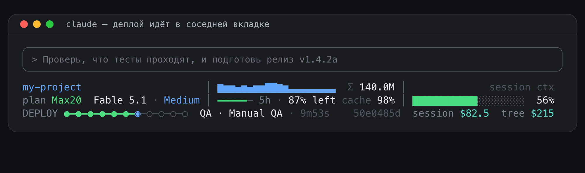
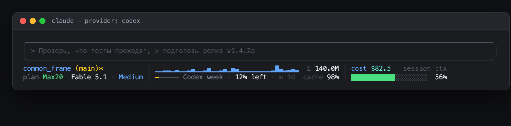
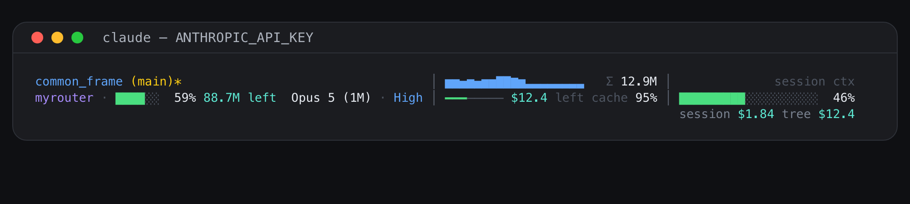
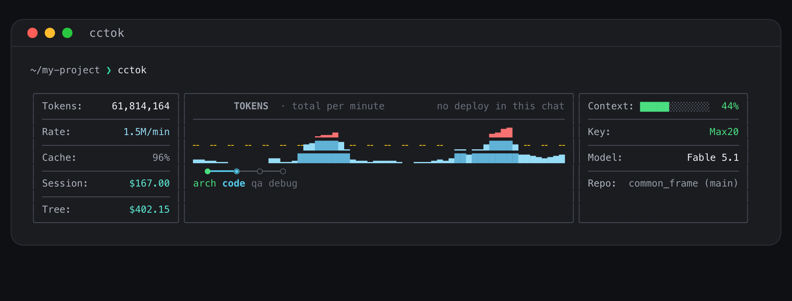
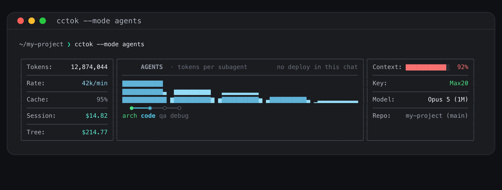

# Common Usage — терминальные панели для Claude Code

Три инструмента, которые показывают, чем занята сессия Claude Code и сколько она стоит.
Все читают транскрипты Claude Code (`~/.claude/projects/**/*.jsonl`), зависимостей нет —
только `python3` из системы (3.8+).

| инструмент | что это |
|---|---|
| `cc_statusline.py` | статуслайн Claude Code: три панели в рамке под промптом |
| `cctok` | панель сессии в терминале, в стиле iStat Menus; живой режим `--watch` |
| `pipeline` | рельс деплоя для Makefile: этапы, тайминги, гейты; виден и в статуслайне |

Ставится установщиком из корня репозитория (`./setup.sh` → продукт **Common Usage**),
блоки можно выбирать по одному: `statusline`, `cctok`, `codex-statusline`, `pipeline`.

---


## Статуслайн

```
my-project (main)              │ ▂▂▂▂▂▃█▇▆▆▅▆▅▆▆██▇▆▃▃▃▃▃▄▄▃▅▆▇   Σ 12.9M │              session ctx
plan Max20  Opus 5 (1M) · High │ ━━━━━━━━━━━━━━━━━━━━━━──  5h · 91% left · ↻ 4h 8m  cache 95% │ █████████░░░░░░░░░░  46%
                                                                                               session $1.84 t 1h 23m 05s
```

| панель | что внутри |
|---|---|
| слева | сверху папка + ветка git; снизу тариф (`plan Max20`, в режиме API-ключа — ключ и остаток токенов) и модель с **уровнем рассуждения** (`Fable 5.1 · High`) |
| по центру | **один график**: общий расход токенов по минутам (input + cache + output), справа от него итог `Σ`; под ним **тонкая линия лимита**: показывает, сколько лимита осталось, и укорачивается по мере расхода (израсходованное серое); зелёная, при остатке ≤ 30 % жёлтая, ≤ 10 % красная. Для подписки берётся тот лимит, которого осталось меньше (`5h` / `week`), для ключа остаток денег; справа доля `cache` |
| справа | заголовок `session ctx` и под ним полоса контекста сессии на всю ширину колонки |
| строка цен | **третья строка**, без рамки и разделителей, выровнена по правой колонке — ровно под полосой контекста: `session` — стоимость этого чата, `t` — сколько этот чат уже идёт (часы, минуты, секунды) |

Рамки нет, только два разделителя между колонками — и третья строка их не рисует вовсе,
цены читаются как подпись под панелью, а не как ещё один ряд таблицы. Панель прижата к левому краю: боковые
колонки по содержимому, центр берёт около 60 % оставшейся ширины (минус `margin`, по умолчанию
4 колонки, столько Claude Code оставляет себе справа). Если панель обрезается, увеличь `margin`
в `statusline.json`; сжимается всегда центральная колонка.

Если в репозитории идёт деплой через `pipeline`, третьей строкой становится `DEPLOY` с рельсом,
а цены едут на ней же — рельс сжимается, чтобы освободить правую колонку, и панель не отращивает
четвёртый ряд ради двух чисел:

```
my-project (main)              │ ▂▂▂▂▂▃█▇▆▆▅▆▅▆▆██▇▆▃▃▃▃▃▄▄▃▅▆▇   Σ 12.9M │              session ctx
plan Max20  Opus 5 (1M) · High │ ━━━━━━━━━━━━━━━━━━━━━━──  5h · 91% left  cache 95% │ █████████░░░░░░░░░░  46%
DEPLOY ●━●━●━●━●━●━◉─○─○─○─○  QA · Manual QA · 9m53s     50e0485d  session $1.84 t 1h 23m 05s
```



Ручное подключение, если не через установщик:

```json
// ~/.claude/settings.json
{
  "statusLine": { "type": "command", "command": "python3 ~/.claude/cc_statusline.py", "padding": 0 }
}
```

### Как считаются цифры

**Стоимость сессии** (`session`) — из `cost.total_cost_usd`, который Claude Code сам кладёт в
stdin статуслайна. Это авторитетная цифра.

**Время сессии** (`t`) — сколько этот чат уже идёт, часы, минуты и секунды (`1h 23m 05s`, минуты и
секунды с ведущим нулём, чтобы строка не прыгала). Берётся из `cost.total_duration_ms` в том же stdin JSON; если
поля нет, отсчёт идёт от самого раннего поминутного ведра токенов в транскрипте до текущего
момента, а без транскрипта вместо времени стоит `—`.
Секунды идут в реальном времени: установщик пишет в `statusLine` настройку `"refreshInterval": 1`,
и Claude Code перезапускает скрипт раз в секунду помимо обычных событий (один рендер — около
90 мс). Поскольку по таймеру Claude Code может отдать тот же самый снимок `total_duration_ms`,
скрипт запоминает последнее увиденное значение и момент, когда его увидел
(`~/.claude/statusline-state/<session>.clock.json`), и, пока значение не меняется, прибавляет
прошедшее время; свежее значение сразу перезаякоривает часы.

**Стоимость ветки** (`tree`) — в статуслайне больше не показывается, но реестр ведётся дальше и
используется `cctok`. Это сколько стоила текущая рабочая ветка целиком: все чаты, когда-либо
записанные для этого репозитория, пока была выкачена эта ветка. Репозиторий определяется через
`git rev-parse --show-toplevel` (для linked worktree — сам worktree), ветка берётся из поля
`gitBranch`, которое Claude Code пишет в каждую запись транскрипта, поэтому сессия, перескочившая
между ветками, раскладывается по веткам правильно, а не списывается на последнюю.

Считается это **не в промпте**: фоновое обновление (`cc_statusline.py --refresh --root <repo>`)
ведёт реестр `~/.claude/statusline-tree/<repo>.json` вида `session → {ветка: $}`. Реестр
инкрементальный — у каждого транскрипта запоминается байтовый офсет, так что после первого
холодного прохода дочитываются только новые строки. Рендер берёт из реестра все *остальные*
сессии ветки и прибавляет живую стоимость текущей: цифра не отстаёт от реестра и не двоится.
Вне git-репозитория (или при `"tree": {"enabled": false}`) вместо суммы стоит `—`.

**Токены** — парсится transcript-файл сессии. Суммируются `input + cache_read + cache_creation
+ output` каждого ответа модели; график — те же суммы, сложенные по минутам. Разбор
**инкрементальный**: состояние лежит в `~/.claude/statusline-state/<session>.json`, при каждом
рендере дочитываются только новые байты, поэтому многомегабайтные транскрипты не тормозят промпт.

**Агенты** (режим `"center": "agents"`) — записи субагентов помечены `isSidechain: true`;
скрипт собирает цепочки по `parentUuid`, привязывает каждую к её вызову `Task` и суммирует
стоимость по прайсу.

**Контекст** — берётся из `context_window.used_percentage`, который Claude Code передаёт в stdin
статуслайна; это его собственная цифра. Если поля нет (старая версия Claude Code, `cctok`),
считается по транскрипту: сумма токенов последнего ответа главной ветки против лимита (200k, либо
1M если использование выше 200k; фиксируется через `context_limit`).

**Уровень рассуждения** — `effortLevel` из `~/.claude/settings.local.json` или `settings.json`
(`low` / `medium` / `high` / `xhigh` / `max`), либо поле `effort` из stdin, если Claude Code его
передаёт. Меняется через `/config` в Claude Code.

**Линия лимита** — в режиме подписки берёт **реальные лимиты плана** с того же эндпоинта, что
и `/usage` в Claude Code (`api.anthropic.com/api/oauth/usage`), с OAuth-токеном самого Claude
Code: на macOS из Keychain (`Claude Code-credentials`), иначе из `~/.claude/.credentials.json`.
Токен никуда, кроме `api.anthropic.com`, не отправляется. Ответ даёт процент по сессии (5h),
неделе и неделе по модели плюс время сброса; показывается окно, которого осталось меньше всего,
и `↻ время до сброса`. Обновляется **в фоне** (`--refresh`) раз в `refresh_seconds`, кэш в
`~/.claude/statusline-cache.json`. Если токена нет, линия считается по локальной оценке расхода
против `limits.session_usd` / `limits.week_usd` и помечается `≈`.

В режиме API-ключа линия показывает остаток денег: баланс роутера, либо `key_budget_usd` минус
расход, либо `key_budget_tokens`, пересчитанный в доллары по цене токена этой сессии (`≈`).

### Лимиты провайдеров

Линия лимита умеет показывать не только Claude. Поле `"provider"` в `statusline.json`:
`auto` (по умолчанию) или один из идентификаторов ниже. В `auto` для подписки берётся Claude,
для API-ключа провайдер угадывается по хосту `ANTHROPIC_BASE_URL`, иначе берётся первый, у
которого на машине есть учётные данные. В `cctok` то же самое показывается в строке `Key`.

| id | провайдер | откуда учётные данные | что показывает |
|---|---|---|---|
| `anthropic` | Claude (подписка) | логин Claude Code: Keychain / `~/.claude/.credentials.json` | окна 5h, неделя, неделя по модели + сброс |
| `codex` | Codex (план ChatGPT) | `~/.codex/auth.json` (`codex login`) | окна 5h / неделя + сброс |
| `gemini` | Gemini CLI / Antigravity | `~/.gemini/oauth_creds.json` | квоты по моделям + сброс |
| `copilot` | GitHub Copilot | `~/.config/github-copilot/apps.json` или `GITHUB_TOKEN` | premium requests + сброс |
| `openrouter` | OpenRouter | `OPENROUTER_API_KEY` | остаток кредитов в $ |
| `deepseek` | DeepSeek | `DEEPSEEK_API_KEY` | баланс |
| `moonshot` | Moonshot / Kimi API | `MOONSHOT_API_KEY` (`MOONSHOT_CN=1` для api.moonshot.cn) | баланс |
| `kimi-code` | Kimi Code (coding plan) | `KIMI_CODE_API_KEY` | окна плана + сброс |
| `zai` | GLM coding plan (Z.ai / BigModel) | `ZAI_API_KEY` или `ZHIPU_API_KEY` (`ZAI_CN=1` для open.bigmodel.cn) | окна 5h / неделя + сброс |
| `minimax` | MiniMax token plan | `MINIMAX_API_KEY` (`MINIMAX_CN=1` для api.minimaxi.com) | окна плана; эндпоинт MiniMax может требовать веб-сессию |

Для балансовых провайдеров линия заполнена целиком, если не задан `key_budget_usd` (тогда
остаток считается от него). Ключи и токены читаются локально и отправляются только на API
своего провайдера. Проверить всех сразу:

```bash
python3 ~/.claude/providers.py          # все, у кого есть учётные данные
python3 ~/.claude/providers.py codex    # один провайдер
```

Claude и Codex проверены вживую; форматы ответов Kimi Code, GLM и MiniMax разбираются
эвристически (ищутся проценты и время сброса), поэтому при изменении их API подпись может
пропасть — тогда `python3 ~/.claude/providers.py <id>` покажет, что вернул сервер.

### Режимы оплаты

Определяются по окружению, в котором Claude Code запустил статуслайн:

| условие | режим | что в левой полоске |
|---|---|---|
| `ANTHROPIC_BASE_URL` указывает не на api.anthropic.com | `router` (имя хоста) | **сколько токенов осталось** |
| `ANTHROPIC_API_KEY` или `ANTHROPIC_AUTH_TOKEN` | `api key` | **сколько токенов осталось** |
| иначе | `sub` + значение `plan` | уровень рассуждения модели |





**Остаток токенов** в режиме ключа берётся из первого настроенного источника:

| источник | как считается |
|---|---|
| `key_budget_tokens` | бюджет в токенах минус токены, потраченные за последние `session_hours` во всех проектах |
| баланс роутера (`router`) | баланс в $ ÷ цена токена; полоска — если известен и расход |
| `key_budget_usd` | бюджет в $ минус расход (роутер → Admin API → локальный скан) ÷ цена токена |

Цена токена — реальная средняя по этой сессии (стоимость ÷ все токены, с учётом кэша); пока
сессия ничего не стоила, берётся цена input из `pricing`, и число помечается `≈`. В `cctok`
остаток показывается в строке `Key`.

### Конфиг `~/.claude/statusline.json`

Создаётся установщиком из `statusline.example.json` и больше не перезаписывается. Минимум,
который стоит поправить:

```json
{
  "plan": "Max20",
  "limits": { "session_usd": 25, "session_hours": 5, "week_usd": 250 }
}
```

`limits` нужны линии бюджета в `cctok`, окну бюджета токенов в режиме API-ключа и запасному
расчёту линии лимита, когда OAuth-токен недоступен.

Ключевые поля:

* `theme` — `dark` | `light` | `mono` (`NO_COLOR=1` тоже отключает цвет)
* `width` — `0` = автоопределение; при ширине < 78 колонок рендерится компактный двухстрочный вариант
* `center` — `tokens` (расход по минутам) или `agents` (спарклайн стоимости по субагентам)
* `max_agents` — сколько столбиков рисовать в режиме `agents`
* `pricing` — цены за 1M токенов по семействам; неизвестное семейство считается по `sonnet`,
  `fable` / `mythos` — по строке `opus`, пока не добавишь свою

**Свой роутер / шлюз:**

```json
"router": {
  "enabled": true,
  "url": "https://router.example.com/v1/balance",
  "token_env": "ROUTER_API_KEY",
  "balance_paths": ["balance", "data.balance"],
  "spent_paths": ["spent", "data.spent"]
}
```

`balance_paths` / `spent_paths` — точечные пути в JSON-ответе, берётся первый существующий.
Запрос идёт в фоне, промпт не блокирует.

**Anthropic Admin API:**

```json
"admin": { "enabled": true, "key_env": "ANTHROPIC_ADMIN_KEY", "window_days": 7 }
```

Нужен admin-ключ в переменной окружения. Парсер суммирует все числовые поля
`amount` / `cost` / `value` в ответе `cost_report`; если цифра не сойдётся, посмотри сырой
ответ и поправь `deep_sum_amounts`.

### Диагностика

```bash
python3 ~/.claude/cc_statusline.py --demo      # превью на фейковых данных
python3 ~/.claude/cc_statusline.py --doctor    # что видит: конфиг, кэш, режим оплаты, ширина
python3 ~/.claude/cc_statusline.py --refresh   # прогнать фоновое обновление руками
```

Если что-то падает, статуслайн никогда не роняет промпт: печатает одну строку
`<модель> · statusline error: …`.

---



## Статус-строка Codex

Codex CLI не умеет запускать внешнюю команду для статуса, только включать встроенные элементы.
Блок `codex-statusline` установщика прописывает в `~/.codex/config.toml`:

```toml
[tui]
status_line = ["git-branch", "model-with-reasoning", "five-hour-limit", "weekly-limit", "context-used", "estimated-thread-cost"]
```

Это даёт в подвале Codex ветку, модель с уровнем рассуждения, оба лимита плана ChatGPT
(5 часов и неделя), занятый контекст и оценку стоимости треда — то же, что показывает наш
статуслайн для Claude. Список принимаемых идентификаторов зависит от версии Codex; посмотреть
и поменять набор можно командой `/statusline` внутри Codex. Прежний `config.toml` сохраняется
как `config.toml.bak`.

Лимиты Codex видны и в статуслайне Claude Code / `cctok`: поставь `"provider": "codex"` в
`~/.claude/statusline.json`.

## cctok — панель сессии

```
╭────────────────────────╮╭──────────────────────────────────────────────────────────────────╮╭────────────────────────────╮
│ Tokens:     12,874,044 ││        TOKENS  · total per minute         no deploy in this chat ││ Context: ███████████░  92% │
│ ────────────────────── ││ ──────────────────────────────────────────────────────────────── ││ ────────────────────────── │
│ Rate:          42k/min ││                      ▁▂▂▄                          ▃▄▇█          ││ Key:                 Max20 │
│ ────────────────────── ││ ╌  ╌  ╌  ╌  ╌  ╌  ╌▅▆████▇▁╌  ╌  ╌  ╌  ╌  ╌  ▁▁ ▁▁▅████▅ ╌  ╌  ╌ ││ ────────────────────────── │
│ Cache:             95% ││ ▃▃▂▂▁▁       ▄▄▁▁▂█████████▃▂▂▁▂▂▂▂▁  ▁▁▁▂▃▂▄██▇████████▇▇▆▅▄▅▆▇ ││ Model:         Opus 5 (1M) │
│ ────────────────────── ││   ●━━━━◉───○───○                                                 ││ ────────────────────────── │
│ Session:        $14.82 ││ arch code qa debug                                               ││ Repo:    my-project (main) │
│ ────────────────────── ││                                                                  ││                            │
│ Tree:          $214.77 ││                                                                  ││                            │
╰────────────────────────╯╰──────────────────────────────────────────────────────────────────╯╰────────────────────────────╯
```

```bash
cctok                 # один кадр
cctok --watch         # живая панель: t — токены, a — агенты, q — выход
cctok --mode agents   # столбцы по субагентам вместо графика во времени
cctok --minutes 120   # окно графика
cctok --which         # какой transcript он читает
cctok --transcript path/to/session.jsonl
```



**Слева** — общий расход токенов сессии, скорость за последние 5 минут, доля cache-read во
входе (чем выше, тем дешевле сессия) и стоимость.
**Справа** — контекст полосой, режим оплаты, модель, репозиторий с веткой.
**В центре сверху** — график расхода по минутам: три ряда по 8 подуровней, 24 уровня на столбец.
**В центре снизу** — роадмап: в какой фазе Common Framework находится ветка.


### Роадмап: две группы

```
arch  code  qa  debug   ┃   pre  tests  push  stand  ready  QA  prod  sec  seo  clean
└──── рабочая ────┘         └──────────── деплойная, включается по факту ───────────┘
```

**Рабочая группа** — фазы Common Framework: Architect → Code → QA → Debug. Видна всегда.
Фаза определяется двумя способами:

1. **Сигнал фреймворка.** Когда корневой агент вызывает скилл или субагента фреймворка
   (`commoncode:mode-architect`, `/develop`, `/ultraprompt`, `/common-master-prompt` → *arch*;
   субагент `mode-code`, `commoncode-dev-base` → *code*; `mode-qa`, `/version-test` → *qa*;
   `commoncode:mode-debug` → *debug*), каретка встаёт на эту фазу. Сигнал действует ещё
   60 событий инструментов, потом считается устаревшим.
2. **Эвристика** по последним ~14 событиям инструментов, если сигнала нет или он устарел:

   | что видно | фаза |
   |---|---|
   | только чтение, поиск, делегирование | `arch` |
   | есть Edit / Write | `code` |
   | запускались тесты (pytest, npm test, go test …) и правок нет | `qa` |
   | есть правки **и** упавшие вызовы инструментов рядом | `debug` |

   Это догадка по поведению, а не объявленное состояние.

**Деплойная группа** появляется только когда в этом чате реально начался деплой — до этого её
на рельсе нет, а в заголовке написано `no deploy in this chat`. Деплой считается начатым по
двум сигналам:

1. в репозитории есть активный прогон `pipeline` (`.pipeline/run.json`) — каретка идёт ровно
   по его этапам;
2. либо агент выполнил команду, похожую на деплой: `make deploy`, `make all`, `./deploy.sh`,
   `docker push`, `kubectl apply`, `fly deploy`, `vercel --prod`, `helm upgrade` и подобные.
   Тогда каретка встаёт на `pre`.

Этап `stand` — выкатка на **тестовый стенд** (в `pipeline` он называется `test`); переименован,
чтобы не путаться с `tests` — прогоном автотестов.

### Линия бюджета

Жёлтый пунктир — скорость расхода токенов, которая при таком темпе ровно израсходует лимит
5-часового окна. Считается через реальный $/токен этой сессии, поэтому появляется только когда
сессия уже что-то стоила. Красным красится часть столбца **выше** линии — видно не
«превысил / не превысил», а насколько и когда.

### Адаптивность

Пока идёт деплой, рельс выглядит как у `pipeline`: точки с подписями этапов. Если обе группы не
влезают по ширине, остаётся только деплойная (рабочие фазы к этому моменту пройдены), затем
подписи сокращаются (`ready` → `rdy`), и лишь потом рельс переходит в компактный режим: одни
точки, справа `QA 9/14`, под ними текстом рабочая группа и статус деплоя.

### Ограничения

* Область данных — **текущая сессия**, кроме строки `Tree`: она про всю рабочую ветку.
  `cctok` берёт самый свежий transcript для текущей папки (если сессия начиналась в подпапке
  репозитория — ищет по всему репозиторию); `--which` покажет какой, `--transcript` задаёт вручную.
  Если найденная сессия относится к другому репозиторию, `Tree` показывает `—`, а не чужую сумму.
* История по минутам живёт в `~/.claude/statusline-state/<сессия>.json`, последние 300 минут.
  Реестр стоимости веток — в `~/.claude/statusline-tree/<репозиторий>.json`.
  За время до установки данных нет.
* Рабочая фаза без сигнала фреймворка — эвристика.
* Деплойная группа не появится, если деплой запущен вне этого чата и без `pipeline`.
* Рельс `DEPLOY` в статуслайне живёт, пока живёт `<repo>/.pipeline/run.json`. Прогон, который
  никто больше не обновляет (прервали `make`, закрыли терминал), состарится и уйдёт с экрана
  через `pipeline.stale_hours` (по умолчанию 6 ч — столько может ждать ручной гейт).
  `pipeline demo` состояние не оставляет: снимок существующего `run.json` возвращается на место.

---


## pipeline — процесс деплоя в терминале

```
━━━━━━━━━━━━━━━━━━━━━━━━━━━━━━━━━━━━━━━━━━━━━━━━━━━━━━━━━━━━━━━━━━━━━━━━━━━━━━━━━━━━━━━━━━━━━━
 STAGE 2/5  Test Ready                                                                 ⏱ 9m 53s
 стенд готов к ручной проверке

  ●━━━━●━━━━━●━━━━━●━━━━◉────○───○───○───○────○
 pre build tests push test ready QA prod sec seo clean
 ⏱ этап test: 26s (прошлый прогон: 19s ▲ +37%)
 ✔ Тестовый стенд обновлён: https://test.example.com

╭─────────────────────────────────────────────────────────────────────────────────────────────╮
│ ✅ Автотесты прошли   ·   версия 50e0485d на test                                           │
│ 🚀 Деплоить на PRODUCTION?                                                                  │
╰─────────────────────────────────────────────────────────────────────────────────────────────╯
 ? [y/N]
```

Один рельс фаз, перерисовывается на каждой stage; зелёный — пройдено, циан — текущая, серый —
впереди. Каждая фаза таймится и сравнивается с прошлым **успешным** прогоном (история в
`.pipeline/history.json`, последние 20 запусков). Жёлтая рамка — блокирующий гейт: `exit 0` =
да, `exit 1` = нет, поэтому `make` сам останавливается на отказе.

### Команды

```bash
pipeline init --name MYAPP --phases pre,build,tests,push,test,ready,QA,prod,sec,seo,clean
pipeline at build                                  # передвинуть каретку, закрыть тайминг прошлой фазы
pipeline stage 2 "Test Ready" --total 5 --at ready --desc "стенд готов к ручной проверке"
pipeline note ok "Тестовый стенд обновлён: …"      # kind: ok fail warn dot time run rocket
pipeline link test https://test.example.com        # попадёт в гейт и в статуслайн
pipeline skip sec,seo                              # фазы рисуются как ◌
pipeline gate "Деплоить на PRODUCTION?" --ok "Автотесты прошли"
pipeline done | pipeline fail "деплой упал"
pipeline status [--json]                           # одна строка для скриптов
pipeline demo                                      # посмотреть, как выглядит
pipeline reset                                     # сбросить состояние прогона
```

Готовый Makefile — `Makefile.example` (после установки: `~/.claude/pipeline.Makefile.example`).
Скелет:

```make
PL := python3 $(HOME)/.claude/pipeline.py

pre:
	@$(PL) init --name MYAPP --phases pre,build,tests,push,test,ready,QA,prod,sec,seo,clean
	@$(PL) at pre
tests:
	@$(PL) at tests
	@npm test || ($(PL) fail "автотесты упали"; exit 1)
qa:
	@$(PL) stage 3 "Manual QA" --total 5 --at QA --desc "опциональная ручная проверка перед продом"
	@$(PL) gate "Деплоить на PRODUCTION?" --ok "Автотесты прошли"
clean:
	@$(PL) done
```

`PIPELINE_LANG=en` переключает подписи на английский.

### Гейты в CI и в автопрогоне

Гейт читает stdin только если это tty. Иначе:

| ситуация | ответ |
|---|---|
| `--auto yes` или `PIPELINE_AUTO=yes` | да |
| `--auto no` / `PIPELINE_AUTO=no` | нет |
| не tty (CI, `make < /dev/null`) | **нет**, если не передан `--default-yes` |

По умолчанию пайплайн в CI не выкатит прод сам — это осознанно.

### Связка со статуслайном

`pipeline` пишет состояние в `<repo>/.pipeline/run.json`. Статуслайн ищет этот файл вверх по
дереву от текущей папки и, если прогон активен, дорисовывает строку:

```
├────────────────────────────────┴─────────────────────────────┴────────────────────────┤
│ DEPLOY ●━●━●━●━●━●━◉─○─○─○─○  QA · Manual QA · 9m53s        ⏸ Деплоить на PRODUCTION? │
└───────────────────────────────────────────────────────────────────────────────────────┘
```

Работает во **всех** терминалах и вкладках Claude Code внутри этого репозитория. Завершённый
прогон висит ещё 10 минут (`pipeline.show_finished_minutes`), потом строка пропадает.
Отключить целиком: `"pipeline": {"enabled": false}` в `statusline.json`.

Добавь `.pipeline/` в `.gitignore` проекта.

### Ограничения

* Статуслайн перерисовывается по событиям Claude Code (примерно раз в 300 мс во время
  работы), а не по таймеру: между ходами картинка стоит.
* Обнаружение режима оплаты идёт по переменным окружения процесса статуслайна. Если
  переключить ключи внутри одной сессии, режим не поменяется до рестарта.
* `.pipeline/run.json` — один активный прогон на репозиторий. Два параллельных деплоя из одной
  папки затрут состояние друг друга.

---

## Прочее

`ansi2html.py` — превращает цветной вывод любой из панелей в самостоятельную HTML-страницу:

```bash
cctok | python3 ~/.claude/ansi2html.py > panel.html
```
